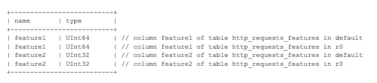

This article explains what happened in the recent Cloudflare incident. To understand the issue, we first need to know what Cloudflare does and then look at what caused the problem.

Cloudflare is an internet infrastructure company that provides services to make websites faster, safer, and more reliable. You can think of it as a protective and performance boosting layer that sits in front of your website.

These are some of the services they provide:

- Content delivery and speed
- Security
- DNS and networking
- CDN (Content Delivery Network)
- Workers and serverless functions
- Zero Trust and access control

For example, when someone visits companydomain.com, the request does not go straight to your server. It first reaches Cloudflare, where the traffic is checked for safety, common content is served from cache, and performance improvements are applied. Only the essential requests are then forwarded to your backend server. This reduces the load on your infrastructure and increases security.

## What actually happened?


### Context 1

The Cloudflare Bot Management program operates within Cloudflare's reverse proxy network to identify, classify, and mitigate automated traffic (bots) that targets a website or application. It performs bot scoring and bot classification, and the user is given an option in the developer platform to allow or block specific bots.

This system uses an ML model that depends on underlying data such as features and patterns. These must be refreshed frequently to remain effective. Cloudflare has publicly stated that the core feature file is regenerated roughly every five minutes. This frequent refresh allows the model to adapt to changing bot attack patterns in real time.

### Context 2

To query data from all shards in a distributed ClickHouse cluster, Cloudflare uses distributed tables located in a database called default. A Distributed engine reads from underlying tables that exist in a database named r0. These underlying tables hold the actual data stored on each shard of the ClickHouse cluster.

The appearance of a replica like r0 or r1 in a ClickHouse deployment reflects a shard and replica architecture. Replication ensures data integrity and failover by maintaining copies of shard data on multiple servers. It also improves query throughput because multiple replicas can answer queries in parallel.

### Before the change

Users had access to the default tables, and programs such as Bot Management could read from these tables, inspect schemas, and run queries like system.tables or system.columns. They also had implicit access to the underlying r0 tables because the distributed tables exposed their structure.

### After the change

Cloudflare wanted to make access to replica tables explicit so that users could see metadata for those tables as well. They pushed an update that allowed distributed subqueries to run under the initial user. This allowed query limits and access grants to be evaluated more precisely.

Once this update was applied, the user context for queries was able to access both r0 and default tables. The Bot Management program then issued a query without specifying a database name, which caused the same table to appear twice, once from each database. This created duplicate rows in the feature file that powers the ML model.

The query they executed was:
```sql
SELECT name, type FROM system.columns WHERE table = 'http_requests_features' order by name;
```

This query was part of the Bot Management feature file generation logic. It is used to construct each input feature in the file described earlier. Because the query now returned results from both r0 and default, the feature list was duplicated.


*This shows the output of the query that caused the problem*

That duplication expanded the final feature list beyond the hard coded limit of 200 features inside the FL2 rust code. Once that limit was exceeded, the Bot Management pipeline broke as there was an unhandled exception in the code, which triggered a chain reaction of failures across Cloudflare services.

## What was the impact?

The outage highlighted how fragile and interconnected internet infrastructure can be. When a widely used web services provider fails, many downstream systems experience immediate problems.

### Digital platforms

Companies that depend on Cloudflare for availability and routing were affected. Some of the major ones include:
- ChatGPT by OpenAI, where users reported access issues
- X (formerly Twitter), where the platform became unavailable or very slow
- Canva, which experienced disruptions according to outage trackers
- League of Legends and other online gaming platforms, which faced connection problems

### Financial services and trading platforms

This sector was hit especially hard. Forex and CFD broker websites reportedly lost an estimated USD 1.58 billion in trading volume during the disruption. Many broker sites displayed an "Internal server error" message, which effectively paused trading operations.

### Government agencies

Several governmental or regulatory websites also experienced disruptions. For example, the United Kingdom's Financial Conduct Authority and MI5 were both reported to be affected by the Cloudflare outage.

Because of the scale of the incident, Cloudflare stock fell nearly 3 percent to around 193 dollars. The stock dropped from levels near 200 dollars and erased about 1.8 billion dollars in market value.

## What can we learn from this?

### Single points of failure remain dangerous, even when they are external

Cloudflare handles roughly 20 to 25 percent of global web traffic. When it goes down, the internet shows clear signs of stress.

**Lesson:** Critical systems should not rely fully on a single provider. Multi CDN strategies such as Cloudflare plus Fastly, Akamai, or AWS CloudFront, along with multi region DNS providers, reduce the risk of one vendor's outage affecting everything.

### Configuration changes that appear simple can produce severe side effects

The incident was triggered by what seemed like a routine database permission change.

**Lesson:** Changes that involve data access, permissions, or distributed systems must be reviewed, tested, and supervised carefully. Small oversights can lead to large scale failures.

### Monitor for global symmetry

Real attacks almost never impact all regions in an exactly uniform way. When global traffic drops at the same instant, it is often a sign of an internal control plane issue, not an external attack.

**Lesson:** The outage lasted about three hours and affected a very large number of users. A faster diagnosis would have helped. A sudden and perfectly symmetric global drop of 40 percent in user requests should have been treated as a strong signal of an internal failure rather than external traffic activity.
